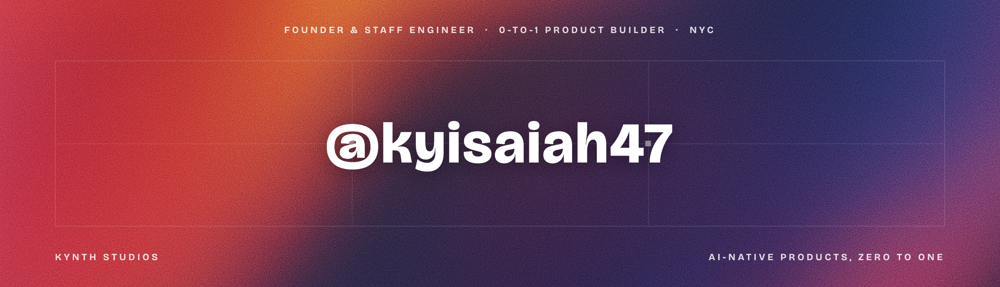

<div align="center">



### Founder &amp; staff engineer. Kynth Studios builds AI-native products from zero to one.

Six pieces of it are installable. Every command below is one line, and the first one needs no key.

[](https://www.npmjs.com/package/kynth-mcp)
[](https://www.npmjs.com/package/@kynth/api-mcp)
[](https://www.npmjs.com/package/n8n-nodes-kynth)

</div>


### [kynth-mcp](https://github.com/kyisaiah47/kynth-mcp) — eleven lookups, no key, no signup

Live public data for the questions a training cutoff gets wrong: what a model costs today and which one your coding tool actually routes to, whether a dependency is still shipping, what a stack bills at a given user count, which agent skills and shadcn registries already exist, ADA Title II reports, nonprofit good standing.

```sh
claude mcp add kynth -- npx -y kynth-mcp
```

In the official MCP registry as `studio.kynth/kynth-mcp`, and listed on [Glama](https://glama.ai/mcp/servers/fhf0eohm9v), [LobeHub](https://lobehub.com/mcp/kyisaiah47-kynth-mcp) and [PulseMCP](https://www.pulsemcp.com/servers?q=kynth).

### Kynth Core — the engine every Kynth Studios product runs on

39 pay-per-call endpoints on one key and one credit wallet — documents to schema-valid JSON, field extraction, PII redaction, contract review, triage, research, moderation, agent memory. 500 free credits a month, no card, and a failed call never costs a credit. Playground, docs and public per-engine benchmarks at **[api.kynth.studio](https://api.kynth.studio)**.

```sh
# Claude Code — the MCP server
claude mcp add kynth-core -e KYNTH_API_KEY=ksk_live_… -- npx -y @kynth/api-mcp

# Claude Code — the plugin: same server, plus three skills that teach Claude when to reach for it
claude plugin marketplace add kyisaiah47/kynth-claude-plugin
claude plugin install kynth-core@kynth

# Gemini CLI
gemini extensions install https://github.com/kyisaiah47/kynth-gemini-extension
```

For **n8n**, install the community node `n8n-nodes-kynth` — every endpoint is an operation, and the node is flagged `usableAsTool`, so n8n AI Agents can call any of them.

In the official MCP registry as `studio.kynth/core`, and listed on [Smithery](https://smithery.ai/server/kyisaiah47/kynth-core) and [Glama](https://glama.ai/mcp/servers/sqfwx4paqc).

### [tearline](https://github.com/kyisaiah47/tearline) — wrap any HTML in one tag and it prints as a thermal receipt

Then `await el.download('receipt.png')` and your users have something they can post. Zero dependencies, no build step, MIT. [Live playground →](https://tearline.kynth.studio)

```html
<script type="module" src="https://tearline.kynth.studio/tearline.js"></script>
<tear-line barcode="047320260726"><h1>Meridian</h1><hr><p>Cortado · 4.25</p></tear-line>
```


**[Kynth Studios](https://kynth.studio)** — an independent studio designing, building and shipping AI-native products end to end. Compliance tooling, developer platforms, consumer software — every one taken from a blank repo to a live product in-house.

- **32 products live**, each on its own `kynth.studio` subdomain.
- Front-paged right now: **[Front Wire](https://frontwire.kynth.studio)** (breaking-news wire and paid archive) · **[Tearline](https://tearline.kynth.studio)** (consumer web component) · **[BenchFile](https://benchfile.kynth.studio)** (NYC Local Law 84) · **[PartsProof](https://partsproof.kynth.studio)** (EU Cyber Resilience Act).
- The distribution above is the same work: one engine, wearing whatever the client speaks.
- **[doc-extract-bench](https://github.com/kyisaiah47/doc-extract-bench)** — the extraction benchmark, run in the open against Textract, Document AI, Veryfi and LlamaParse. Pinned datasets, pre-registered subsets, committed raw responses, keyless re-scoring.


`TypeScript` · `Next.js 16 (App Router)` · `React 19` · `Tailwind v4` · `Turborepo + pnpm` · `Supabase (Postgres RLS)` · `Stripe` · `Claude + Gemini` · `MCP` · `PostHog` · `Vercel`

<details>
<summary>Recognition, the fuller toolbox, and eight years before the studio</summary>

<br>

- 🥇 **1st Place — Starknet Re{Solve} Hackathon** · Bitcoin Unleashed Track (Xverse Prize Pool), Oct 2025 — for [BTCUSD](https://github.com/kyisaiah47/btcusd-stablecoin), a Bitcoin-backed stablecoin with automatic Vesu yield routing: Cairo contracts, liquidation engine, keeper bots, RN app.
- 🎖 **HackFS Finalist, ETHGlobal** — Split Protocol, a cross-token payment splitter on Uniswap.
- 📐 **OGC 2026 — LG CNS Optimization Grand Challenge** · Tier 3 of 19 (~top 15%), solo US entry against 200+ teams. A parallel SA-LNS solver that beats the baseline on 19 of 20 instances, up to 349× improvement.

**The fuller toolbox**

- **AI & agents** — Claude Code, Claude API, Gemini, MCP, multi-agent orchestration
- **Frontend** — Next.js, React, React Native, Angular, Vue.js, TypeScript, Tailwind, shadcn/ui, Framer Motion
- **Product infra** — Stripe, multi-tenant Supabase + Google OAuth (Postgres RLS), AWS Aurora DSQL, Resend, Vercel, signed webhooks
- **Backend** — Node.js, Python, Java Spring Boot, GraphQL, OpenAPI, WebSockets
- **DevOps & tooling** — Turborepo, Azure DevOps, GitHub Actions, Playwright, PostHog, GoJS, Figma

**Before the studio — eight years shipping**

- **SS&C Technologies** — Senior Software Engineer, Private Markets. Designed an AI-assisted code-generation system that cut an *estimated* 12+ months of work to 2–3 months across 2,000+ clients and 17+ report types. Sole web engineer for the division: 6 enterprise apps, plus a 109-component Angular DevOps platform used daily by 20–30 engineers.
- **Capital Technology Group** — full-stack on a USCIS government contract (uscis.gov), serving millions of users, with WCAG accessibility.
- **No Name Charli** — team lead of 3; shipped a live NFT mint (Next.js, Ethers.js, Solidity).
- **Visneta** — led a full Vue.js redesign at a proptech startup.
- **Drexel University** — B.S. Computer Science, *Cum Laude*.

</details>

<br>

<div align="center">

**[kynth.studio](https://kynth.studio)** · **[LinkedIn](https://linkedin.com/in/kyisaiah47)** · **[kyisaiah47@gmail.com](mailto:kyisaiah47@gmail.com)**

<sub>New York City · he/him</sub>

</div>
