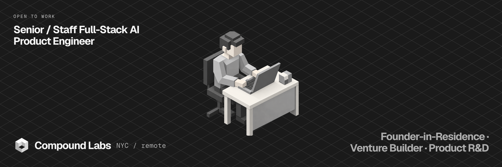
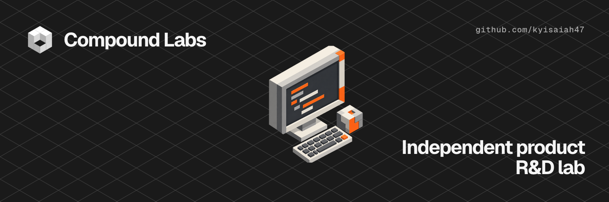
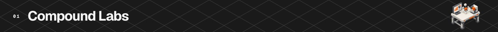
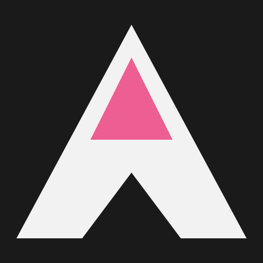
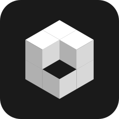

**Full-time · NYC or remote · US citizen · no sponsorship required. [Send me the role →](mailto:kyisaiah47@gmail.com)**

### Founder &amp; product builder at Compound Labs. Senior full-stack engineer focused on 0→1 AI products.

**[thecompound.tech](https://thecompound.tech)** · **[LinkedIn](https://linkedin.com/in/kyisaiah47)** · **[Email](mailto:kyisaiah47@gmail.com)**

I have 8+ years as a full-stack engineer, including 3+ at senior level. I do my best work on ambiguous 0→1 builds where I can own the path from research and product strategy through UX, engineering, launch, and operation.

### Compound Labs

**[Compound Labs](https://thecompound.tech)** is my independent product R&amp;D lab. I research opportunities and underserved problems, turn the strongest ones into working software, launch them, and operate the systems behind them.

The products are deliberately not confined to one category. The range—applied AI, accessibility compliance, cybersecurity readiness, developer tools, data products, workflow automation, and consumer experiments—is part of the research.

- **Complete product ownership** — strategy, UX, engineering, authentication, billing, data, automation, analytics, launch, and ongoing operations.
- **Applied AI as an engineering system** — structured outputs, model routing, per-call cost and latency telemetry, tenant-scoped memory, reproducible benchmarks, and quality gates.
- **Shared operating infrastructure** — reusable multi-tenant foundations, payments, scheduled workflows, browser automation, integrations, publishing, and one internal console for the catalog.
- **Distribution alongside product** — SEO, newsletters, automated content systems, social publishing, and product-level analytics.

### Agentic products

Each of these runs a pass on its own, reads the source documents, drafts the action, and waits for a person to approve it before anything leaves the building.

| | Product | What the agent does |
| :-: | --- | --- |
|  | **[Unemploy](https://unemploy.co)** | Unemployment claims desk for employers with no claims specialist. Agents answer every claim inside the state's window, and every window is computed by a rules table from the date on the notice. |
|  | **[FetchDue](https://fetchdue.thecompound.tech)** | Collections agent for agencies. It works the overdue list out of your own mailbox, reads what each client replies, drafts the answer in your voice, and follows up until the money lands. |
|  | **[TriageDesk](https://triagedesk.thecompound.tech)** | Overnight triage agent for a shared inbox. It reads support@ overnight, drafts every reply, and holds an approved send for 120 seconds before it goes. |
|  | **[CoverCheck](https://covercheck.thecompound.tech)** | Reads each vendor's certificate of insurance, checks the limits and endorsements against your requirements, flags what is short or expiring, and chases the agent for the renewal. |
|  | **[ClauseWatch](https://clausewatch.thecompound.tech)** | Re-reads every uploaded contract each night, finds the term end and the notice period, and emails you before an auto-renewal locks in. It never states a date it could not find. |
|  | **[MatchRail](https://matchrail.thecompound.tech)** | Three-way match for the month-end close. It reconciles the purchase order, the receipt and the bill against your QuickBooks or Xero ledger overnight and queues only the ones that disagree. |
|  | **[CardChase](https://cardchase.thecompound.tech)** | Retries failed subscription charges on the schedule you set and writes the customer in your voice. It stops on any card the network has already refused. |
|  | **[StarReply](https://starreply.thecompound.tech)** | Review-reply agent for multi-location businesses. It reads the night's reviews, drafts each reply, and holds an approved one 30 seconds before it posts. |
|  | **[LeadGrade](https://leadgrade.thecompound.tech)** | Inbound lead agent for founder-led sales. It scores every lead that arrived overnight and ranks the queue highest first. |
|  | **[ListRun](https://listrun.thecompound.tech)** | Fills the submission form on every free startup, AI and SaaS directory a product qualifies for, and returns one row per directory, including the ones nothing was attempted on and why. |
|  | **[BreachProbe](https://breachprobe.thecompound.tech)** | Signs up two throwaway users against a live app and checks whether row-level security really isolates them. |
|  | **[PolicyDrift](https://policydrift.thecompound.tech)** | Loads a page in a real browser, records every third party it contacts, reads the privacy policy the page links to, and reports each one against the other. |

### AI developer tools

| | Product | What it does |
| :-: | --- | --- |
|  | **[Compound MCP](https://github.com/kyisaiah47/compound-mcp)** | Eleven keyless tools that give agents current model routing and pricing, dependency health, stack costs, agent-skill discovery, registry search, and public compliance data. |
|  | **[ParseRail](https://parserail.thecompound.tech)** | Production AI back end with 44 endpoints, four SDKs, MCP, structured outputs, model routing, per-call telemetry, and evaluation gates. |
|  | **[AgentWire](https://agentwire.thecompound.tech)** | Index of shipped MCP servers, coding-agent harnesses and agent frameworks, built from curated lists, Hacker News, star velocity and topic signals, credited to whoever built it. |
|  | **[SkillWorks](https://skillworks.thecompound.tech)** | Every Claude Code skill, subagent and plugin, read from the source and scored 0 to 100 on four weighted components, every night. |
|  | **[RuleStack](https://rulestack.thecompound.tech)** | Gallery of real AGENTS.md, CLAUDE.md, Cursor, Copilot, Windsurf, GEMINI.md and Cline files, scraped from live repositories every night, classified by stack and scored. Capabilities are asserted; adoption is measured. |
|  | **[ToolDrift](https://tooldrift.thecompound.tech)** | Which coding model Cursor, Claude Code and Copilot are running tonight, scored on what developers actually run inside their tools and re-counted every night. |
|  | **[StillShipping](https://stillshipping.thecompound.tech)** | Which agent tools have stopped shipping, rescored every night from the GitHub API. |
|  | **[Toolproof](https://toolproof.thecompound.tech)** | Independent measurement layer for AI agent tooling: nine execution-tested indexes, one published method, and open data. |

### Engineering background

#### SS&amp;C Technologies — Senior Software Engineer, Private Markets

I was the division’s only web engineer, owning frontend architecture and cross-functional delivery across six enterprise applications.

- Architected and delivered the MVP of a 109+ component Angular DevOps platform in three months, retired the legacy application it replaced in five, and reduced per-client pipeline work from roughly 10 minutes to 30 seconds. It became the daily operating surface for 30+ engineers.
- Designed an AI-assisted code-generation system that compressed an estimated 12+ months of financial-reporting development into 2–3 months for a platform supporting 2,000+ clients and 17+ report types.
- Built a 36-component Angular library and custom CLI that reduced new frontend setup from days to minutes.
- Built a GoJS fund-visualization tool supporting 1,000+ node graphs across five layout algorithms.

### Earlier work

- **Capital Technology Group** — React and Java Spring Boot on a USCIS government contract serving millions of users, including WCAG accessibility work.
- **NoNameCharli** — led three junior engineers and shipped a live NFT mint across Next.js, Ethers.js, Hardhat, and Solidity.
- **Visneta** — led a complete Vue.js product redesign in direct collaboration with company leadership.
- **Drexel University** — B.S. Computer Science, *Cum Laude*.

<strong>Recognition and technical range</strong>

 

- 🥇 **1st Place — Starknet Re{Solve} Hackathon**, Bitcoin Unleashed Track (Xverse Prize Pool), Oct 2025 — [BTCUSD](https://github.com/kyisaiah47/btcusd-stablecoin), a Bitcoin-backed stablecoin with automatic Vesu yield routing.
- 🎖 **HackFS Finalist, ETHGlobal** — Split Protocol, a cross-token payment splitter on Uniswap.
- 📐 **OGC 2026 — LG CNS Optimization Grand Challenge** — Tier 3 of 19 (~top 15%), solo US entry against 200+ teams; the solver beat the baseline on 19 of 20 instances, by up to 349×.

**Core stack**

`TypeScript` · `Next.js 16` · `React 19` · `Tailwind v4` · `Node.js` · `Python` · `Java Spring Boot` · `Postgres` · `Supabase RLS` · `Stripe` · `MCP` · `Playwright` · `AWS` · `Vercel`

**Product and AI systems**

Applied AI and agents · structured outputs · model routing · evals · multi-tenant architecture · billing · data pipelines · browser automation · analytics · SEO · content and publishing systems

 

**Open to Senior / Staff Full-Stack AI Product Engineer roles.**

**[Email](mailto:kyisaiah47@gmail.com)** · **[LinkedIn](https://linkedin.com/in/kyisaiah47)** · **[Compound Labs](https://thecompound.tech)** · **[Buy me a coffee](https://buymeacoffee.com/kyisaiah47)**

New York City · remote · US citizen · no sponsorship required

